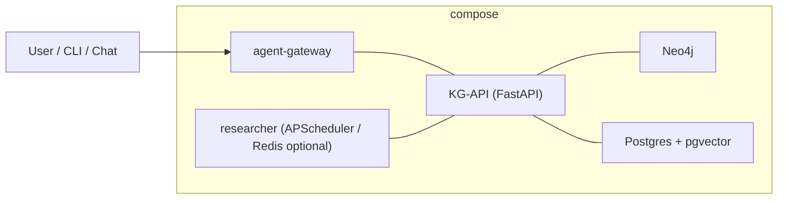

```mermaid
graph LR
  subgraph compose
    K["KG-API (FastAPI)"] 
    G["agent-gateway"]
    N["Neo4j"]
    P["Postgres + pgvector"]
    RQ["researcher (APScheduler / Redis optional)"]
  end
  G --- K
  K --- N
  K --- P
  RQ --- K
  U["User / CLI / Chat"] --> G

 
``` 