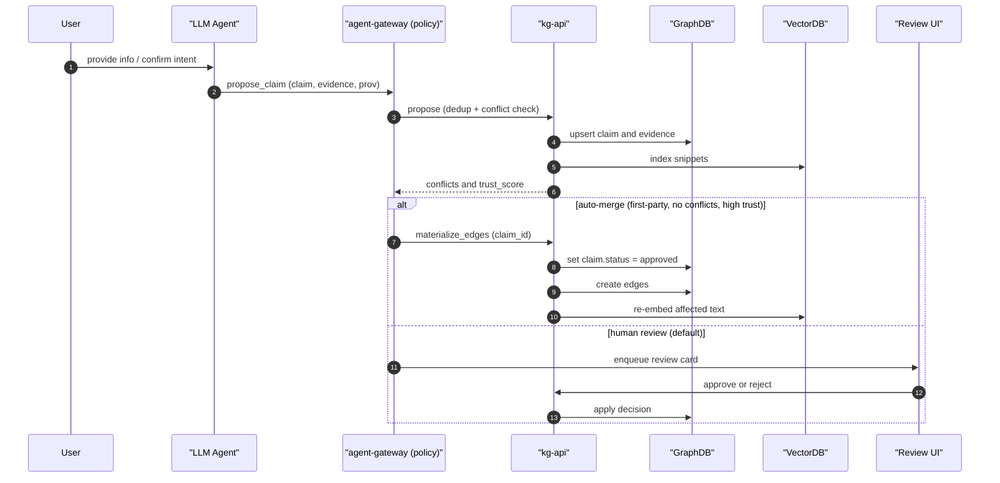

```mermaid
%% Diagram 3 — Write Path (Propose -> Gate -> Materialize)

sequenceDiagram
autonumber
participant User
participant Agent as "LLM Agent"
participant GW as "agent-gateway (policy)"
participant API as "kg-api"
participant GDB as "GraphDB"
participant VDB as "VectorDB"
participant UI as "Review UI"

User->>Agent: provide info / confirm intent
Agent->>GW: propose_claim (claim, evidence, prov)
GW->>API: propose (dedup + conflict check)
API->>GDB: upsert claim and evidence
API->>VDB: index snippets
API-->>GW: conflicts and trust_score

alt auto-merge (first-party, no conflicts, high trust)
  GW->>API: materialize_edges (claim_id)
  API->>GDB: set claim.status = approved
  API->>GDB: create edges
  API->>VDB: re-embed affected text
else human review (default)
  GW->>UI: enqueue review card
  UI->>API: approve or reject
  API->>GDB: apply decision
end


``` 