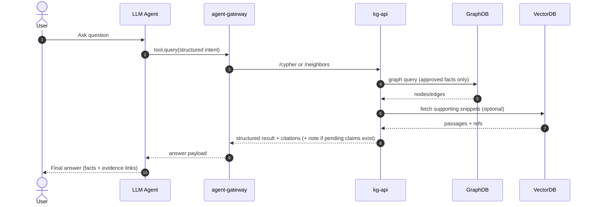

```mermaid
%% Diagram 4 — Read Path (Deterministic first, then fuse)

sequenceDiagram
  autonumber
  actor User
  participant Agent as LLM Agent
  participant GW as agent-gateway
  participant API as kg-api
  participant GDB as GraphDB
  participant VDB as VectorDB

  User->>Agent: Ask question
  Agent->>GW: tool.query(structured intent)
  GW->>API: /cypher or /neighbors
  API->>GDB: graph query (approved facts only)
  GDB-->>API: nodes/edges 
  API->>VDB: fetch supporting snippets (optional)
  VDB-->>API: passages + refs
  API-->>GW: structured result + citations (+ note if pending claims exist)
  GW-->>Agent: answer payload
  Agent-->>User: Final answer (facts + evidence links)

``` 