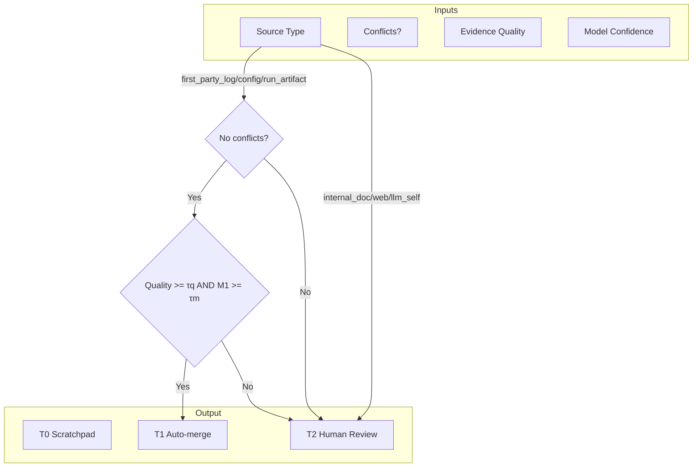

```mermaid
graph TB
  subgraph Inputs
    S1[Source Type]
    C1[Conflicts?]
    Q1[Evidence Quality]
    M1[Model Confidence]
  end

  subgraph Output
    T0[T0 Scratchpad]
    T1[T1 Auto-merge]
    T2[T2 Human Review]
  end

  %% Rules (example defaults) 
  S1 -->|first_party_log/config/run_artifact| R1{No conflicts?}
  R1 -->|Yes| R2{Quality >= τq AND M1 >= τm}
  R1 -->|No| T2
  R2 -->|Yes| T1
  R2 -->|No| T2

  S1 -->|internal_doc/web/llm_self| T2
``` 