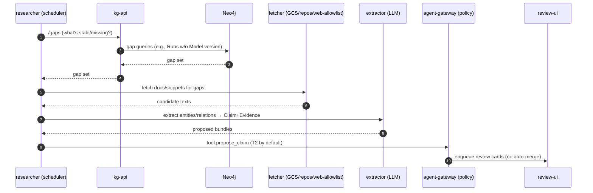

```mermaid
%% Background Research Loop (allowlist + ledger only)
sequenceDiagram
  autonumber
  participant SCH as researcher (scheduler)
  participant API as kg-api
  participant KG as Neo4j
  participant F as fetcher (GCS/repos/web-allowlist)
  participant X as extractor (LLM)
  participant GW as agent-gateway (policy)
  participant UI as review-ui

  SCH->>API: /gaps (what's stale/missing?)
  API->>KG: gap queries (e.g., Runs w/o Model version)
  KG-->>API: gap set
  API-->>SCH: gap set 
  SCH->>F: fetch docs/snippets for gaps
  F-->>SCH: candidate texts
  SCH->>X: extract entities/relations → Claim+Evidence
  X-->>SCH: proposed bundles
  SCH->>GW: tool.propose_claim (T2 by default)
  GW->>UI: enqueue review cards (no auto-merge)
``` 