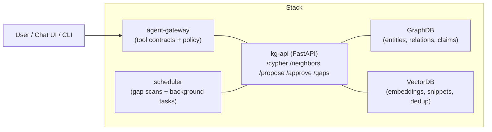

```mermaid

%% FILE: schema.md  (you can keep all blocks in one Markdown file)
%% Diagram 1 — Minimal Compose Topology (clean slate, no other-project deps)

flowchart LR
  subgraph Stack
    GW["agent-gateway<br/>(tool contracts + policy)"]
    API["kg-api (FastAPI)<br/>/cypher /neighbors /propose /approve /gaps"]
    GDB["GraphDB<br/>(entities, relations, claims)"]
    VDB["VectorDB<br/>(embeddings, snippets, dedup)"]
    SCH["scheduler<br/>(gap scans + background tasks)"]
  end

  U["User / Chat UI / CLI"] --> GW
  GW --- API
  API --- GDB
  API --- VDB
  SCH --- API 

``` 